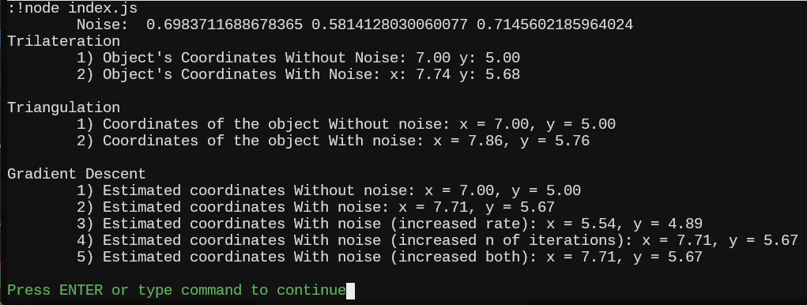
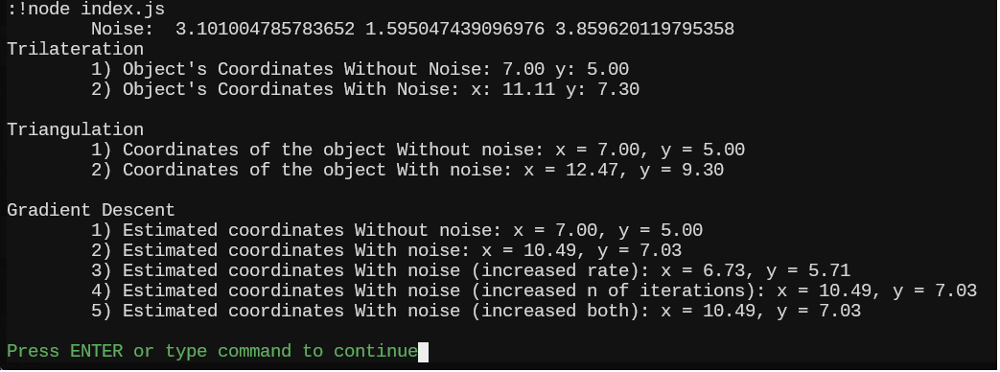
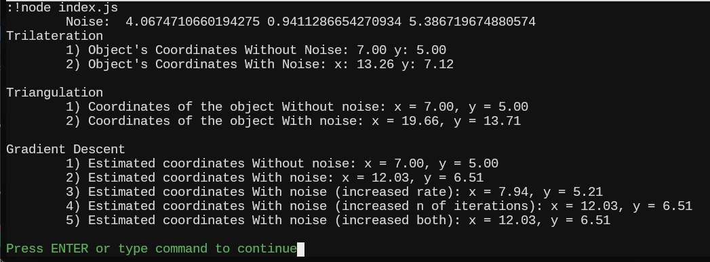
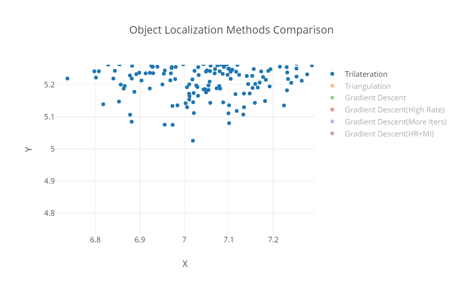
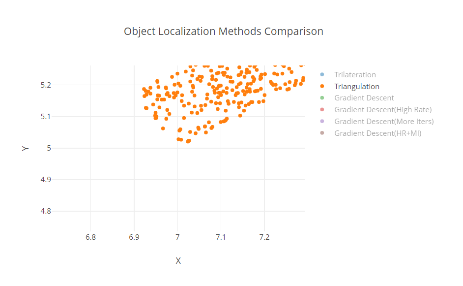
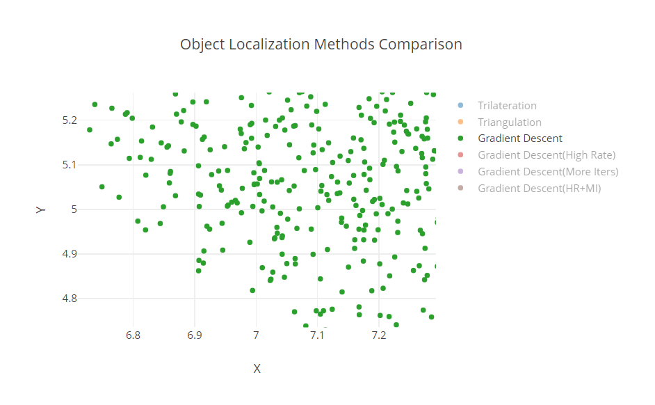
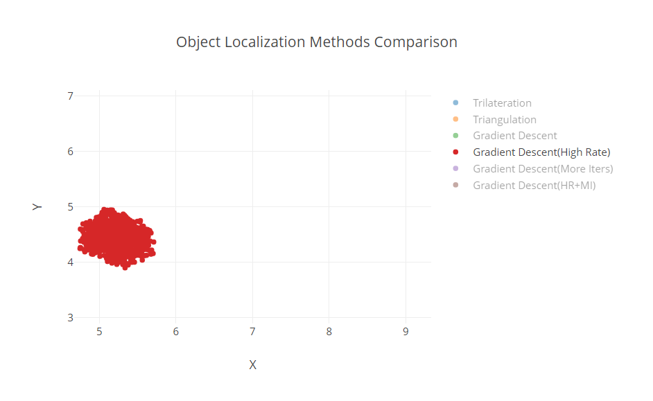
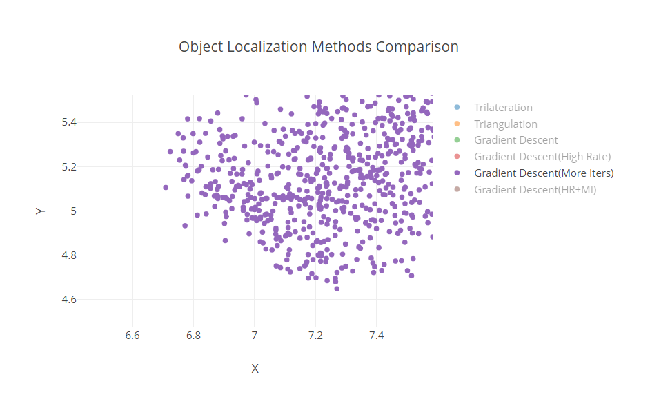
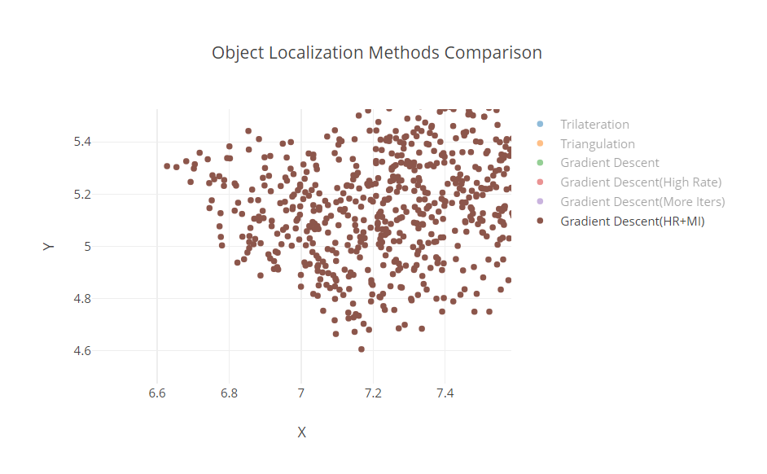

# Practice #3

## Topic:

Studying methods for determining the coordinates of an object

## Objective:

The primary goal of this practical session is to teach students how to determine the coordinates of an object in two-dimensional space using trilateration, triangulation, and gradient descent methods. Students will explore the impact of noise on measurement accuracy and how various parameters affect the efficiency of the gradient descent method.

## Conclusion

### Let's consider the computational results with single object

#### Noise between 0 and 1

#

#### Noise between 0 and 5

#

#### Noise between 0 and 10

#

- ##### Trilateration has [~0.71, ~4.19] deviation, and also has middle results.
- ##### Triangulation has [~0.81, ~10.69] deviation, value is close to the worst.
- ##### Gradient Descent has different situation for each of the configurations of its parameters:
  - **Default** value (LR=0.1 and Iters=1000) deviats from the correct one by [~0.69, ~3.27], what is enough accurate.
  - With increased **learning rate** (LR=0.001 and Iters=1000) we have huge deviation for X value and we can see that a point tends to the origin [~ -0.785, ~0.575]. So we can conclude that it may not be a good approach to increase only learning rate (that is, decreasing step), but we have better noise immunity, than it is in triangulation.
  - When only a **number of iterations** is increased (LR=0.1 and Iters=100000) [~0.69, ~3.27], we obtain more precise values, but for single point we cannot see a full picture.
  - When **both** of the parameters are increased (LR=0.001 and Iters=100000) [~0.69, ~3.27], we should obtain the most accurate result, but a single point cannot give us the full picture.

#

### Let's dive deep into accuracy and observe what may happen if a number of experiments will be 1000

#### Trilateration

#

#### Triangulation

#

#### Gradient Descent

#

#### Gradient Descent with High Learning Rate (HR)

#

#### Gradient Descent with More Iterations amount (MI)

#

#### Gradient Descent with Both HR and MI

#

_Our object has coordinates: x = 7.0, y = 5.0_

- ##### Trilateration has average density (3-5 points) around original coordinates.
- ##### Triangulation has more appropriate density (10+ points), but simulatenously has high deviation (especially for X values).
- ##### Gradient Descent has different situation for each of the configurations of its parameters:
  - **Default** is enough accurate, and shows better results than all the above methods (Trilateration and Triangulation) and we have a lot of points around (7;5) coordinates.
  - With increased **learning rate**. What should be mentiond is the tend to the origin (it is close to the left bottom corner where is the origin (0,0)). So, this parameter can cause to unwanted distortions and take a lot of computational resources. No the nearest points to (7;5).
  - When only a **number of iterations** is increased, we obtain more precise values, even more accurate than **default** one. So iterations amount makes sense.
  - When **both** of the parameters are increased, we obtain the most accurate result, thus it can be viewed as the most appropriate, but we must remember about computational complications, we need more performant hardware.

### Ranking:

1. Gradient Descent (**both**)
2. Gradient Descent (**default**)
3. Gradient Descent (**defnumber if iterations**)
4. Trilateration
5. Triangulation
6. Gradient Descent (**learning rate**)
